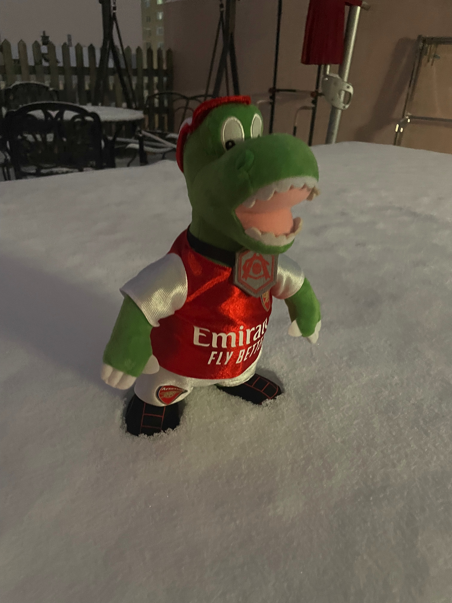

---
# the default layout is 'page'
icon: fas fa-info-circle
order: 4
---

I'm MonsieurSeed, a high school student from Beijing, China. I'm currently very curious about computational sociology and machine learning. 

I'm interested in anime and watching football. The anime I've enjoyed during the past months is *Sousou no Frieren*. As for watching football, I am an Arsenal supporter.
<figure style="text-align: center;">
  
  <figcaption style="font-weight: bold;">Gunnersaurus, Arsenal's mascot</figcaption>
</figure>

On this website, you'll find blogs covering topics such as computational sociology, machine learning, and my daily life. Feel free to explore and take a look!
